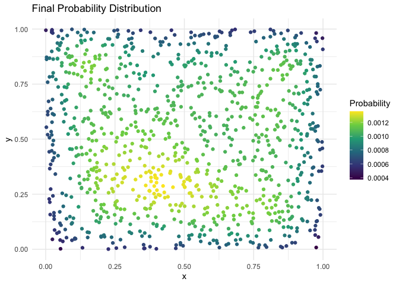

# Solutions for lab 4
George G Vega Yon
2026-09-17

# Part 1

## Problem 1

``` r
simulate_pi <- function(n = 5e6) {
  inside <- 0
  for (i in 1:n) {
    x <- runif(1, -1, 1)
    y <- runif(1, -1, 1)
    if (x^2 + y^2 <= 1) inside <- inside + 1
  }
  4 * inside / n
}

set.seed(1)
simulate_pi(1e5) # Smaller value to render quicker
```

    [1] 3.13588

``` r
profvis::profvis({
  simulate_pi <- function(n = 5e6) {
    inside <- 0
    for (i in 1:n) {
      x <- runif(1, -1, 1)
      y <- runif(1, -1, 1)
      if (x^2 + y^2 <= 1) inside <- inside + 1
    }
    4 * inside / n
  }

  set.seed(1)
  simulate_pi()
})
```

The bottle neck is located in the `runif()`call. Calling this repeatedly
is not ideal; instead, we can do a single call.

``` r
simulate_pi2 <- function(n = 5e6) {

  points <- runif(n * 2, -1, 1) |> 
    matrix(ncol = 2)

  mean(rowSums(points^2) <= 1) * 4
}

microbenchmark::microbenchmark(
  simulate_pi(10000),
  simulate_pi2(10000),
  unit = "relative"
)
```

    Warning in microbenchmark::microbenchmark(simulate_pi(10000),
    simulate_pi2(10000), : less accurate nanosecond times to avoid potential
    integer overflows

    Unit: relative
                    expr      min       lq    mean   median       uq      max neval
      simulate_pi(10000) 67.85646 56.96139 50.5057 55.71564 54.19037 8.257476   100
     simulate_pi2(10000)  1.00000  1.00000  1.0000  1.00000  1.00000 1.000000   100

Notice this could be even faster if we skip the `matrix` step and
instead use two calls to `runif()`–the matrix step has to allocate
memory again.

## Problem 2

``` r
make_kernel <- function(coords, bandwidth) {
  d <- as.matrix(dist(coords))
  K <- exp(-(d / bandwidth)^2)
  K / rowSums(K)
}

simulate_spread <- function(coords, p0, nsteps = 300, bandwidth = 0.15) {
  p <- p0
  for (s in seq_len(nsteps)) {
    K <- make_kernel(coords, bandwidth)
    p <- as.vector(p %*% K)
    p <- p / sum(p)
  }
  p
}

set.seed(2)
k <- 1000
coords <- cbind(runif(k), runif(k))
p0 <- rep(1 / k, k)

p_final <- simulate_spread(coords, p0)
summary(p_final)
```

         Min.   1st Qu.    Median      Mean   3rd Qu.      Max. 
    0.0003746 0.0008619 0.0010566 0.0010000 0.0011313 0.0013588 

Let’s create a plot to visualize the spatial distribution of the final
probabilities.

``` r
library(ggplot2)
```

    Warning: package 'ggplot2' was built under R version 4.5.2

``` r
df <- data.frame(x = coords[, 1], y = coords[, 2], p = p_final)
ggplot(df, aes(x = x, y = y, color = p)) +
  geom_point() +
  scale_color_viridis_c() +
  theme_minimal() +
  labs(title = "Final Probability Distribution", color = "Probability")
```



Inspecting the profiling of the model, we can see that the bottleneck is
in the `make_kernel()` function. Since the kernel does not require
update, we can safely move it outside the loop:

``` r
make_kernel <- function(coords, bandwidth) {
  d <- as.matrix(dist(coords))
  K <- exp(-(d / bandwidth)^2)
  K / rowSums(K)
}

simulate_spread2 <- function(coords, p0, nsteps = 300, bandwidth = 0.15) {
  p <- p0
  K <- make_kernel(coords, bandwidth) # Moving the kernel outside
  for (s in seq_len(nsteps)) {
    p <- as.vector(p %*% K)
    p <- p / sum(p)
  }
  p
}

microbenchmark::microbenchmark(
  simulate_spread(coords, p0, nsteps = 50),
  simulate_spread2(coords, p0, nsteps = 50),
  unit = "relative",
  times = 10
)
```

    Unit: relative
                                          expr     min       lq     mean  median
      simulate_spread(coords, p0, nsteps = 50) 12.2275 13.28465 14.93011 14.2847
     simulate_spread2(coords, p0, nsteps = 50)  1.0000  1.00000  1.00000  1.0000
           uq      max neval
     19.62095 11.71628    10
      1.00000  1.00000    10
